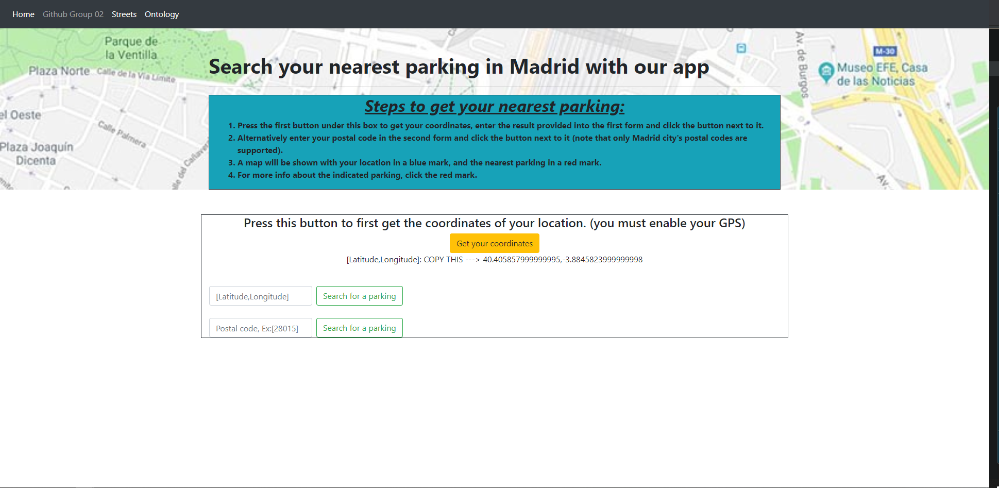

# ParkingSlots-App - GROUP 02
<h2><b>App developed by:</b></h2>
<table>
<tr>
<th>Full name</th>
<th>GitHub</th>
</tr>
<tr>
<th>Salas Rodrigues, Adrián</th>
<th><a href = "https://github.com/adrix1341/Curso2020-2021">adrix1341 (Leader)</a></th>
</tr>
<tr>
<th>Martín Lesmes, Rafael</th>
<th>lesmesrafa</th>
</tr>
<tr>
<th>Fuentes Ampudia, Adrián</th>
<th> adrefts</th>
</tr>
<tr>
<th>López Mihali, Augusto José</th>
<th>AJLM</th>
</tr>
</table>

<h2><b>Explication of the app</b></h2>
<p>This linked-data app made in Flask is about looking for the nearest parking of your location introducing either your coordinates(latitude and longitude with a [Latitude,Longitude] format, or your postal code. <br>
When you introduce one of them, you will see a map with a blue mark (your location), and a red mark(the parking)
</p>
<h2><b>User Interface</b></h2>
<h3>Main page</h3>
</img>
<h3>Map page</h3>
</img>
<h2><b>Explication of the app folders</b></h2>
<ul>
<li><b>static:</b> empty</li>
<li><b>templates:</b> Inside there are the html files
<ul>
<li>index.html: The principal html file for the index of the app</li>
<li>distance.html: The html in which you will see the map with the marks</li>
<li>ontology.html: It shows a list with the ontology classes, data and object properties</li>
<li>streets.html: It shows a list with the parking streets</li>
</ul>
</li>
<li><b>venv:</b> Dependencies of the app</li>
<li><b>app.py:</b> Python file of the app</li>
</ul>
<h2><b>Functions of the app:</b></h2>
<ul>
<li>

```python
def return_distance(latitude_user,longitude_user,coords):
    '''This function return the distance between
    two streets in kilometers'''
    coord_user = (latitude_user, longitude_user)
    return geodesic(coord_user, coords).kilometers
```
This function returns the distance in kilometres
between the user coordinates(latitude and longitude) and the coordinates of a street of our dataset we want to measure.<br>
This function is useful in order to know which is the user nearest parking.
</li>
<li>

```python
@app.route('/Distance', methods=["POST"])
def sparql_search():
    street = request.form.get("street")
    postalCode = request.form.get("postalCode")

    #We have to separate the latitude and the longitude
    if street:
        latitude = str(street).split(',')[0]
        longitude = str(street).split(',')[1]
    else:
        geolocator = Nominatim(user_agent="Geoparking")
        location_user = geolocator.geocode({"postalcode":postalCode})
        latitude, longitude = location_user.latitude, location_user.longitude

    actual_dist = -1
    parking = ''
    totalslots= -1
    addressid= ''
    schedule= ''
    province = ''
    city = ''
    district = ''
    neighborhood = ''
    wikistreet = ''
    wikiprovince = ''
    wikicity = ''
    wikidistrict = ''
    wikineighborhood = ''
    image = ''
    g = Graph()
    github_storage = "https://raw.githubusercontent.com/adrix1341/Curso2020-2021/master/HandsOn/Group02/rdf/output" \
                     "-with-links.nt "
    g.parse(github_storage, format="nt")

    findparking = Namespace("http://findyourparking.es/lcc/ontology/Parking#")
    owl = Namespace("http://www.w3.org/2002/07/owl#")
    wikidata = Namespace("http://www.wikidata.org/prop/direct/")

    q1 = prepareQuery('''
                     SELECT DISTINCT ?x ?parkname ?y ?street ?lat ?lon ?totalslots ?addressid ?schedule ?wikistreet ?province ?city ?district ?neighborhood ?wikiprovince ?wikicity ?wikidistrict ?wikineighborhood
                     WHERE {
                      ?x rdf:type findparking:Parking.
                      ?x findparking:hasName ?parkname.
                      ?x findparking:hasTotalSlots ?totalslots.
                      ?x findparking:hasSchedule ?schedule.
                      ?y rdf:type findparking:Address.
                      ?x findparking:hasProvince ?p.
                      ?x findparking:hasCity ?c.
                      ?x findparking:hasDistrict ?d.
                      ?x findparking:hasNeighborhood ?n.
                      ?p findparking:hasProvince ?province.
                      ?p owl:sameAs ?wikiprovince.
                      ?c owl:sameAs ?wikicity.
                      ?d owl:sameAs ?wikidistrict.
                      ?n owl:sameAs ?wikineighborhood.
                      ?c findparking:hasCity ?city.
                      ?d findparking:hasDistrict ?district.
                      ?n findparking:hasNeighborhood ?neighborhood.
                      ?x findparking:hasAddress ?y.
                      ?y findparking:hasAddressId ?addressid.
                      ?y findparking:hasStreet ?street.
                      ?y owl:sameAs ?wikistreet. 
                      ?x findparking:hasLatitude ?lat.
                      ?x findparking:hasLongitude ?lon
                     }
                     ORDER BY ASC(?street)
                     ''',
                      initNs={"findparking": findparking, "rdf": RDF, "owl": owl, "wikidata": wikidata}
                      )

    for st in g.query(q1):

        parkini,streeti,latitudi,longitudi,totalsloti,addressidi,scheduli = st.parkname, st.street, st.lat, st.lon, st.totalslots, st.addressid, st.schedule
        wikistreeti, wikiprovinci, wikiciti, wikidistricti, wikineighborhoodi = st.wikistreet, st.wikiprovince, st.wikicity, st.wikidistrict, st.wikineighborhood
        provinci, citi, districti, neighborhoodi = st.province, st.city, st.district, st.neighborhood
        coordlist = [latitudi, longitudi]

        if street:
            km = return_distance(latitude,longitude, tuple(coordlist))
        else:
            auxList = [location_user.latitude, location_user.longitude]
            km= geodesic(tuple(auxList), tuple(coordlist)).kilometers

        if actual_dist == -1:
            actual_dist = km
            parking = parkini
            park_street = streeti
            totalslots=totalsloti
            addressid=addressidi
            schedule=scheduli
            province=provinci
            city=citi
            district=districti
            neighborhood=neighborhoodi
            wikistreet=wikistreeti
            wikiprovince=wikiprovinci
            wikicity=wikiciti
            wikidistrict=wikidistricti
            wikineighborhood=wikineighborhoodi
            pk_lat = latitudi
            pk_long = longitudi
        elif km < actual_dist:
            actual_dist = km
            parking = parkini
            park_street = streeti
            totalslots = totalsloti
            addressid = addressidi
            schedule=scheduli
            province = provinci
            city = citi
            district = districti
            neighborhood = neighborhoodi
            wikistreet = wikistreeti
            wikiprovince = wikiprovinci
            wikicity = wikiciti
            wikidistrict = wikidistricti
            wikineighborhood = wikineighborhoodi
            pk_lat = latitudi
            pk_long = longitudi

    wd=Namespace("https://www.wikidata.org/wiki#")

    wiki1 = wikistreet.split('Q')[1]
    wiki1 = 'Q' + wiki1
    query2 = str('''
                         PREFIX wikidata: <http://www.wikidata.org/prop/direct/>
                         SELECT DISTINCT ?image
                         WHERE {
                          wd:'''+ wiki1 + ''' wikidata:P18 ?image
                          
                         }
                         ''')


    endpoint_url = "https://query.wikidata.org/sparql"
    def get_results(endpoint_url, query2):
        user_agent = "WDQS-example Python/%s.%s" % (sys.version_info[0], sys.version_info[1])
        # TODO adjust user agent; see https://w.wiki/CX6
        sparql = SPARQLWrapper(endpoint_url, agent=user_agent)
        sparql.setQuery(query2)
        sparql.setReturnFormat(JSON)
        return sparql.query().convert()

    results = get_results(endpoint_url, query2)
    imaget = ''
    for result in results["results"]["bindings"]:
        imaget = str(result)
    # Splitting the object to obtain only the link
    imaget = imaget.split('h')[1] + 'h' + imaget.split('h')[2]
    imaget = 'h' + imaget   #Inserting the h for http://
    imaget = imaget.split("'")[0]

    map = folium.Map(
        location = [pk_lat, pk_long],
        zoom_start = 12
    )
    folium.Marker(
        location=[pk_lat, pk_long],
        popup=("Your nearest parking is: " + '<b>' +parking +'</b>'+", at "+str(actual_dist)+" km from your current position." + '<br>' + '<b>Parking Info:</b>' + '<br>' + "  -Address: " + ' <a href=' + wikistreet + '>' + addressid + '</a>' + '<br>'
               + "  -Province: " + '<a href=' + wikiprovince + '>' + province + '</a><br>' + "  -City: " + ' <a href=' + wikicity + '>' + city + '</a>' + '<br>'
               + "  -District: " + ' <a href=' + wikidistrict + '>' + district + '</a>' + '<br>'
               + "  -Neighborhood: " + ' <a href=' + wikineighborhood + '>' + neighborhood + '</a>' + '<br>' +
               "  -TotalSlots: " + totalslots + '<br>' + "  -Schedule: " + schedule + '<br>' +'<style>img{width: 100%;height: auto;}</style>' + '</img'),
        tooltip="Click here for more info.",
        icon=folium.Icon(color='red', icon='star')
    ).add_to(map)
    folium.Marker(
        location=[latitude, longitude],
        popup="<b>You are here.</b>",
        tooltip="Click Here!"
    ).add_to(map)

    return map._repr_html_()
```
This function extracts all the parking information that we need of our output-with-links.nt in GitHub
, find the nearest parking with the return_distance function and generate an html file with the map that describes
the user location in a blue mark, and the location of the nearest parking in a red mark.  
</li>
<li>

```python
@app.route('/Ontology')
def ontology():
    g = Graph()
    github_storage = "https://raw.githubusercontent.com/adrix1341/Curso2020-2021/master/HandsOn/Group02/ontology/ontology_updated.ttl"
    g.parse(github_storage, format="ttl")
    ss = []
    pp = []
    oo = []
    for s, p, o in g:
        ss.append(s)
        pp.append(p)
        oo.append(o)
    return render_template("ontology.html", ss=ss,pp=pp,oo=oo)
```
This function obtains our ontology in GitHub and save it in a Graph, to then save in three lists
all the ontology data for later showing it in the ontology.html file.
</li>
<li>

```python
@app.route('/Streets')
def show_dataset():
    g = Graph()
    github_storage = "https://raw.githubusercontent.com/adrix1341/Curso2020-2021/master/HandsOn/Group02/rdf/output" \
                     "-with-links.nt "
    g.parse(github_storage, format="ttl")
    findparking = Namespace("http://findyourparking.es/lcc/ontology/Parking#")
    qp = prepareQuery('''
          SELECT DISTINCT  ?streets ?parkingname ?totalslots
          WHERE { 
           ?x rdf:type findparking:Parking.
           ?x findparking:hasName ?parkingname.
           ?x findparking:hasTotalSlots ?totalslots.
           ?y rdf:type findparking:Address.
           ?x findparking:hasAddress ?y.
           ?y findparking:hasAddressId ?streets
          }
          ORDER BY ASC(?streets)
          ''',
                      initNs={"findparking": findparking, "rdf": RDF}
                      )
    parkings = []
    streets = []
    totalslots =[]
    for r in g.query(qp):
        parkings.append(r.parkingname)
        streets.append(r.streets)
        totalslots.append(r.totalslots)
    return render_template("streets.html", streets=streets)
```
This function obtains the streets in our output-with-links.nt file with a SPARQL query, and render an html file
(streets.html) to show there all the parking streets available in our dataset 
</li>
</ul>
<h2><b>SPARQL queries of the app</b></h2>
<h3>Query 1: To get all the information of the nearest parking of the user´s location (parking name, street,coordinates, slots..., and their respective URL in wikidata for some cases(Street,Province,City,District,Neighborhood))</h3>

```
SELECT DISTINCT ?x ?parkname ?y ?street ?lat ?lon ?totalslots ?addressid ?schedule ?wikistreet ?province ?city ?district ?neighborhood ?wikiprovince ?wikicity ?wikidistrict ?wikineighborhood
                     WHERE {
                      ?x rdf:type findparking:Parking.
                      ?x findparking:hasName ?parkname.
                      ?x findparking:hasTotalSlots ?totalslots.
                      ?x findparking:hasSchedule ?schedule.
                      ?y rdf:type findparking:Address.
                      ?x findparking:hasProvince ?p.
                      ?x findparking:hasCity ?c.
                      ?x findparking:hasDistrict ?d.
                      ?x findparking:hasNeighborhood ?n.
                      ?p findparking:hasProvince ?province.
                      ?p owl:sameAs ?wikiprovince.
                      ?c owl:sameAs ?wikicity.
                      ?d owl:sameAs ?wikidistrict.
                      ?n owl:sameAs ?wikineighborhood.
                      ?c findparking:hasCity ?city.
                      ?d findparking:hasDistrict ?district.
                      ?n findparking:hasNeighborhood ?neighborhood.
                      ?x findparking:hasAddress ?y.
                      ?y findparking:hasAddressId ?addressid.
                      ?y findparking:hasStreet ?street.
                      ?y owl:sameAs ?wikistreet. 
                      ?x findparking:hasLatitude ?lat.
                      ?x findparking:hasLongitude ?lon
                     }
                     ORDER BY ASC(?street)
```
<h3>Query 2: In order to get the street image in wikidata for the nearest parking in the user´s location</h3>

```

 PREFIX wikidata: <http://www.wikidata.org/prop/direct/>
                         SELECT DISTINCT ?image
                         WHERE {
                          wd:'''+ wiki1 + ''' wikidata:P18 ?image
                          
                         }
```

<h4>For this query, we imported sqlwrapper in order to execute this query in the sparql endpoint of wikidata.</h4>
<p>The Prefix wikidata is the URI to join with a property of wikidata, in this case we used P18,
that says that the subject wd:wiki1 has an image <b>?image</b>.
</p>
<p>?image is the variable that we want to extract from the query,and its value is the URL of an image,
an URL that we used in order to with the tag: 
</p>

```html
</img>
```

