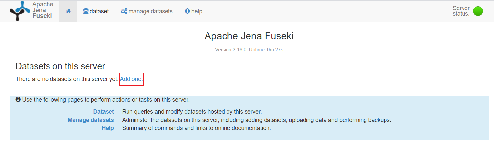
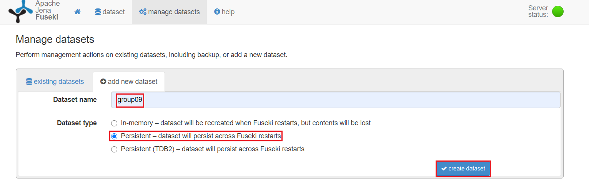
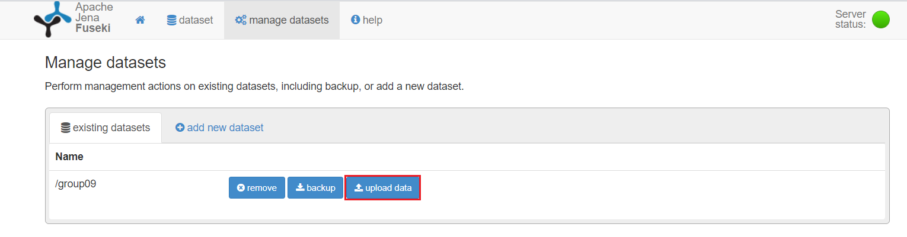
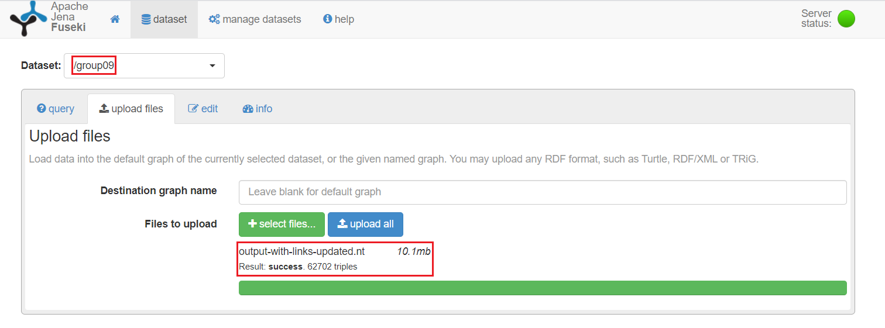

# MadridAccidents App

This application is used to look for accidents that have occurred in Madrid during the months of January and February of 2020.

The data has been extracted from an RDF that has been prepared from a CSV throughout the course.
This RDF has been joined to Wikidata (go to the [**Note**](#note) section for further details) to obtain additional information of the 21 districts of Madrid (population, location on the map, ...).

You can extract the information through 9 filters:
  - Type of accident (crash, run over, collision)
  - Age range age of the person involved in the accident
  - Sex of the affected person
  - Injury status of the affected person
  - Month in which the accident occurred
  - District where the accident occurred
  - Vehicles involved in the accident
  - 1-hour intervals in which the accident can occur
  - Weather at the time of the accident
 
You also have the possibility of not applying any filter if you wish.

### Tools
- To storage the rdf, an [**Apache Jena Fuseki**](https://jena.apache.org/documentation/fuseki2/) endpoint has been used.
- The [**Apache Jena**](https://jena.apache.org/) libraries, available for Java, have been used to program and perform the queries against the endpoint.
- The IDE that has been used to generate the interface is [**NetBeans**](https://netbeans.org/).
- [**Eclipse IDE**](https://www.eclipse.org/ide/) has been used for the programming and testing of the application for convenience.
- To create the graphical interface, the [**Swing**](https://docs.oracle.com/javase/1.5.0/docs/guide/swing/) library, also available for Java, has been used.

### How to run the application
  - Queries are made against a **Fuseki endpoint**. So before running the application **you should start a server and load the RDF** called *output-with-links-updated.nt*, which is found in the *resources* folder of the project.
  - You can see the status of the server by entering the following URL in the browser:
    ```sh 
    http://localhost:3030/
     ```
  - Once there, if you have launched the server correctly, you can upload the RDF to the server. **You can load it persistently. So you will not have to add it again every time you want to use the application**.
  
- To load the RDF, you must create a dataset called **group09**, since the application makes the queries to the following endpoint:
    ```sh 
    http://localhost:3030/group09/sparql
     ```
 - Once the dataset has been successfully created, the RDF (*output-with-links-updated.nt*) **must be uploaded to that dataset**.
   
   Here you have in a more detailed way the steps to be followed to add the rdf correctly to the server:

   
   
   
   
   
   
   
  
 - Once this is done, you will be able to run the application. It will interact with the RDF that is hosted on the server. And it will return different results depending on the filters you set.
 
 - You can run the application in two ways:
    - Executing the jar that is in the root directory of the project using the command:
      ```sh 
      java -jar madrid-accidents-app.jar
      ```
    - If you are a Windows user, you can directly run the executable found in the root folder of the project: **madrid-accidents-app.exe**

### How to use the application
- Once inside the application, you will simply have to click on the  *START* button.
- Then select the filters you want to apply. If you do not select any filter, the application will use the default values to perform the queries.
- You can also set the maximum number of queries you want to receive.
- Once the values are selected, click on the *SEARCH* button. The results obtained will be displayed in a table. 
- If you click with the mouse in any cell of the columns *Images* and *Localization*, a browser window will open with an image or map of each district respectively.
- If no results were found, a panel will appear informing you to search again with different values.
- If you want to keep looking for information, you just have to click on the *SEARCH AGAIN* button.

### Note

We know that what gives value to reconcile a column in our CSV is that you can access other information that is related to that column but is not in our dataset.
However, for the development of the application we have not been able to use the **owl:sameAs** property.
Since we have not found the programmatic way (*QueryExecutionFactory.sparqlService*) to be able to assign two different endpoints to the same query.

We also try to connect our endpoint with the one of wikidata using the following federated query, which would be the equivalent query to the two that we have done separately and later we have joined in Java:
```
PREFIX  rdfs: <http://www.w3.org/2000/01/rdf-schema#>
PREFIX  ont:  <http://linkeddata.es/group09/ontology/TrafficAccident#>
PREFIX  rdf:  <http://www.w3.org/1999/02/22-rdf-syntax-ns#>
PREFIX  owl:  <http://www.w3.org/2002/07/owl#>
PREFIX  wdt:  <http://www.wikidata.org/prop/direct/>

SELECT DISTINCT  ?id_accident ?street_crossing_label ?district ?postal_code ?population ?image ?localization
WHERE
  { ?accident  rdfs:label   ?id_accident ;
              ont:occursOn  ?street_crossing .
    ?street_crossing
              rdfs:label    ?street_crossing_label ;
              wdt:P131      ?district_csv .
    ?district_csv
              rdfs:label    ?district ;
              owl:sameAs    ?district_wikidata
    SERVICE <https://query.wikidata.org/sparql>
      { OPTIONAL
          { ?district_wikidata
                      wdt:P1082  ?population
          }
        OPTIONAL
          { ?district_wikidata
                      wdt:P281  ?postal_code
          }
        OPTIONAL
          { ?district_wikidata
                      wdt:P18  ?image
          }
        OPTIONAL
          { ?district_wikidata
                      wdt:P402  ?localization
          }
      }
  }
LIMIT   500
```

But it did not return any results. We got the following error: 

```
13:04:57 WARN  ResponseProcessCookies :: Invalid cookie header: "Set-Cookie: WMF-Last-Access=31-Oct-2020;Path=/;HttpOnly;secure;Expires=Wed, 02 Dec 2020 12:00:00 GMT". Invalid 'expires' attribute: Wed, 02 Dec 2020 12:00:00 GMT
13:04:57 WARN  ResponseProcessCookies :: Invalid cookie header: "Set-Cookie: WMF-Last-Access-Global=31-Oct-2020;Path=/;Domain=.wikidata.org;HttpOnly;secure;Expires=Wed, 02 Dec 2020 12:00:00 GMT". Invalid 'expires' attribute: Wed, 02 Dec 2020 12:00:00 GMT
13:05:13 INFO  Fuseki          :: [5] 200 OK (17,511 s)
```

As you can see from the last line, it should have done the query successfully but if we remove the OPTIONAL statements, as for example in the following query:
```
PREFIX  rdfs: <http://www.w3.org/2000/01/rdf-schema#>
PREFIX  ont:  <http://linkeddata.es/group09/ontology/TrafficAccident#>
PREFIX  rdf:  <http://www.w3.org/1999/02/22-rdf-syntax-ns#>
PREFIX  owl:  <http://www.w3.org/2002/07/owl#>
PREFIX  wdt:  <http://www.wikidata.org/prop/direct/>

SELECT DISTINCT  ?id_accident ?street_crossing_label ?district ?population
WHERE
  { ?accident  rdfs:label   ?id_accident ;
              ont:occursOn  ?street_crossing .
    ?street_crossing
              rdfs:label    ?street_crossing_label ;
              wdt:P131      ?district_csv .
    ?district_csv
              rdfs:label    ?district ;
              owl:sameAs    ?district_wikidata
    SERVICE <https://query.wikidata.org/sparql>
      { ?district_wikidata
                  wdt:P1082  ?population
      }
  }
LIMIT   500
```

We get the following error repeatedly:
```
13:09:18 WARN  ResponseProcessCookies :: Invalid cookie header: "Set-Cookie: WMF-Last-Access=31-Oct-2020;Path=/;HttpOnly;secure;Expires=Wed, 02 Dec 2020 12:00:00 GMT". Invalid 'expires' attribute: Wed, 02 Dec 2020 12:00:00 GMT
13:09:18 WARN  ResponseProcessCookies :: Invalid cookie header: "Set-Cookie: WMF-Last-Access-Global=31-Oct-2020;Path=/;Domain=.wikidata.org;HttpOnly;secure;Expires=Wed, 02 Dec 2020 12:00:00 GMT". Invalid 'expires' attribute: Wed, 02 Dec 2020 12:00:00 GMT
13:09:18 WARN  ResponseProcessCookies :: Invalid cookie header: "Set-Cookie: WMF-Last-Access=31-Oct-2020;Path=/;HttpOnly;secure;Expires=Wed, 02 Dec 2020 12:00:00 GMT". Invalid 'expires' attribute: Wed, 02 Dec 2020 12:00:00 GMT
13:09:18 WARN  ResponseProcessCookies :: Invalid cookie header: "Set-Cookie: WMF-Last-Access-Global=31-Oct-2020;Path=/;Domain=.wikidata.org;HttpOnly;secure;Expires=Wed, 02 Dec 2020 12:00:00 GMT". Invalid 'expires' attribute: Wed, 02 Dec 2020 12:00:00 GMT
13:09:19 WARN  ResponseProcessCookies :: Invalid cookie header: "Set-Cookie: WMF-Last-Access=31-Oct-2020;Path=/;HttpOnly;secure;Expires=Wed, 02 Dec 2020 12:00:00 GMT". Invalid 'expires' attribute: Wed, 02 Dec 2020 12:00:00 GMT
13:09:19 WARN  ResponseProcessCookies :: Invalid cookie header: "Set-Cookie: WMF-Last-Access-Global=31-Oct-2020;Path=/;Domain=.wikidata.org;HttpOnly;secure;Expires=Wed, 02 Dec 2020 12:00:00 GMT". Invalid 'expires' attribute: Wed, 02 Dec 2020 12:00:00 GMT
13:09:19 WARN  ResponseProcessCookies :: Invalid cookie header: "Set-Cookie: WMF-Last-Access=31-Oct-2020;Path=/;HttpOnly;secure;Expires=Wed, 02 Dec 2020 12:00:00 GMT". Invalid 'expires' attribute: Wed, 02 Dec 2020 12:00:00 GMT
13:09:19 WARN  ResponseProcessCookies :: Invalid cookie header: "Set-Cookie: WMF-Last-Access-Global=31-Oct-2020;Path=/;Domain=.wikidata.org;HttpOnly;secure;Expires=Wed, 02 Dec 2020 12:00:00 GMT". Invalid 'expires' attribute: Wed, 02 Dec 2020 12:00:00 GMT
13:09:19 WARN  ResponseProcessCookies :: Invalid cookie header: "Set-Cookie: WMF-Last-Access=31-Oct-2020;Path=/;HttpOnly;secure;Expires=Wed, 02 Dec 2020 12:00:00 GMT". Invalid 'expires' attribute: Wed, 02 Dec 2020 12:00:00 GMT
13:09:19 WARN  ResponseProcessCookies :: Invalid cookie header: "Set-Cookie: WMF-Last-Access-Global=31-Oct-2020;Path=/;Domain=.wikidata.org;HttpOnly;secure;Expires=Wed, 02 Dec 2020 12:00:00 GMT". Invalid 'expires' attribute: Wed, 02 Dec 2020 12:00:00 GMT
13:09:19 WARN  ResponseProcessCookies :: Invalid cookie header: "Set-Cookie: WMF-Last-Access=31-Oct-2020;Path=/;HttpOnly;secure;Expires=Wed, 02 Dec 2020 12:00:00 GMT". Invalid 'expires' attribute: Wed, 02 Dec 2020 12:00:00 GMT
13:09:19 WARN  ResponseProcessCookies :: Invalid cookie header: "Set-Cookie: WMF-Last-Access-Global=31-Oct-2020;Path=/;Domain=.wikidata.org;HttpOnly;secure;Expires=Wed, 02 Dec 2020 12:00:00 GMT". Invalid 'expires' attribute: Wed, 02 Dec 2020 12:00:00 GMT
13:09:19 WARN  ResponseProcessCookies :: Invalid cookie header: "Set-Cookie: WMF-Last-Access=31-Oct-2020;Path=/;HttpOnly;secure;Expires=Wed, 02 Dec 2020 12:00:00 GMT". Invalid 'expires' attribute: Wed, 02 Dec 2020 12:00:00 GMT
13:09:19 WARN  ResponseProcessCookies :: Invalid cookie header: "Set-Cookie: WMF-Last-Access-Global=31-Oct-2020;Path=/;Domain=.wikidata.org;HttpOnly;secure;Expires=Wed, 02 Dec 2020 12:00:00 GMT". Invalid 'expires' attribute: Wed, 02 Dec 2020 12:00:00 GMT
13:09:19 WARN  ResponseProcessCookies :: Invalid cookie header: "Set-Cookie: WMF-Last-Access=31-Oct-2020;Path=/;HttpOnly;secure;Expires=Wed, 02 Dec 2020 12:00:00 GMT". Invalid 'expires' attribute: Wed, 02 Dec 2020 12:00:00 GMT
13:09:19 WARN  ResponseProcessCookies :: Invalid cookie header: "Set-Cookie: WMF-Last-Access-Global=31-Oct-2020;Path=/;Domain=.wikidata.org;HttpOnly;secure;Expires=Wed, 02 Dec 2020 12:00:00 GMT". Invalid 'expires' attribute: Wed, 02 Dec 2020 12:00:00 GMT
13:09:19 WARN  ResponseProcessCookies :: Invalid cookie header: "Set-Cookie: WMF-Last-Access=31-Oct-2020;Path=/;HttpOnly;secure;Expires=Wed, 02 Dec 2020 12:00:00 GMT". Invalid 'expires' attribute: Wed, 02 Dec 2020 12:00:00 GMT
13:09:19 WARN  ResponseProcessCookies :: Invalid cookie header: "Set-Cookie: WMF-Last-Access-Global=31-Oct-2020;Path=/;Domain=.wikidata.org;HttpOnly;secure;Expires=Wed, 02 Dec 2020 12:00:00 GMT". Invalid 'expires' attribute: Wed, 02 Dec 2020 12:00:00 GMT
13:09:19 WARN  ResponseProcessCookies :: Invalid cookie header: "Set-Cookie: WMF-Last-Access=31-Oct-2020;Path=/;HttpOnly;secure;Expires=Wed, 02 Dec 2020 12:00:00 GMT". Invalid 'expires' attribute: Wed, 02 Dec 2020 12:00:00 GMT
13:09:19 WARN  ResponseProcessCookies :: Invalid cookie header: "Set-Cookie: WMF-Last-Access-Global=31-Oct-2020;Path=/;Domain=.wikidata.org;HttpOnly;secure;Expires=Wed, 02 Dec 2020 12:00:00 GMT". Invalid 'expires' attribute: Wed, 02 Dec 2020 12:00:00 GMT
13:09:19 WARN  ResponseProcessCookies :: Invalid cookie header: "Set-Cookie: WMF-Last-Access=31-Oct-2020;Path=/;HttpOnly;secure;Expires=Wed, 02 Dec 2020 12:00:00 GMT". Invalid 'expires' attribute: Wed, 02 Dec 2020 12:00:00 GMT
13:09:19 WARN  ResponseProcessCookies :: Invalid cookie header: "Set-Cookie: WMF-Last-Access-Global=31-Oct-2020;Path=/;Domain=.wikidata.org;HttpOnly;secure;Expires=Wed, 02 Dec 2020 12:00:00 GMT". Invalid 'expires' attribute: Wed, 02 Dec 2020 12:00:00 GMT
13:09:20 WARN  ResponseProcessCookies :: Invalid cookie header: "Set-Cookie: WMF-Last-Access=31-Oct-2020;Path=/;HttpOnly;secure;Expires=Wed, 02 Dec 2020 12:00:00 GMT". Invalid 'expires' attribute: Wed, 02 Dec 2020 12:00:00 GMT
13:09:20 WARN  ResponseProcessCookies :: Invalid cookie header: "Set-Cookie: WMF-Last-Access-Global=31-Oct-2020;Path=/;Domain=.wikidata.org;HttpOnly;secure;Expires=Wed, 02 Dec 2020 12:00:00 GMT". Invalid 'expires' attribute: Wed, 02 Dec 2020 12:00:00 GMT
```

We did a little research and found the case of a person who had the same problem as us (https://stackoverflow.com/questions/59937684/sparql-query-to-get-data-from-wikidata-not-working) but we can't find a way to fix it. Right now it is a problem for which we have not found a solution.

**The photos showing these errors are also available in the *resources* folder of the application.**

This query was successful:
```
PREFIX  rdfs: <http://www.w3.org/2000/01/rdf-schema#>
PREFIX  ont:  <http://linkeddata.es/group09/ontology/TrafficAccident#>
PREFIX  rdf:  <http://www.w3.org/1999/02/22-rdf-syntax-ns#>
PREFIX  owl:  <http://www.w3.org/2002/07/owl#>
PREFIX  wdt:  <http://www.wikidata.org/prop/direct/>
SELECT DISTINCT ?id_accident ?street_crossing_label ?district_wikidata
WHERE{
	?accident  rdfs:label   ?id_accident ;
              ont:occursOn  ?street_crossing .
    ?street_crossing
              rdfs:label    ?street_crossing_label ;
              wdt:P131      ?district_csv .
    ?district_csv
              rdfs:label    ?district ;
              owl:sameAs    ?district_wikidata
}
LIMIT   500
```
But we considered the option of being able to show the image and location on the map of each district in a concrete way directly in the table rather than putting a link to the Wikidata resource and having to search among all the properties that are there.

**So what we have done is to make a different query to each endpoint (ours and Wikidata's one) and program a join through the *District* column.**

License
----
This work is licensed under the license **CC BY NC SA 4.0 International**
You are free to:
- to Share to copy, distribute and transmit the work
- to Remix, to adapt the work

[](https://creativecommons.org/licenses/by-nc-sa/4.0/)