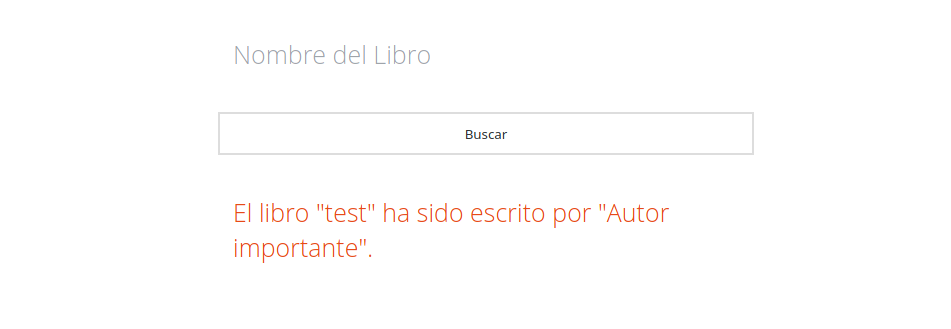

# ACM-libraly-web
(Se que es library, pero hay que mantener la consistencia con las erratas.)  

Web app para manejar la biblioteca de ACM. (Mostrar todos los libros, mostrar los libros disponibles, añadir nuevos libros, eliminar libros...)

# Instalación y Ejecución
(Dando por hecho que se tiene `nodejs` instalado.)  
Tras clonar el repo ejecutar `npm install` y luego `cd src` y `npm server.js`. Luego abre tu buscador de confianza aka firefox :3 y el server esta en `localhost:3000`. No podras buscar ningun lisbro por que para ello necesitas el repo de `Alfedi/BOOM` ejecutando en la misma máquina :3 (en un futuro dare mas detalles de como montarlo todo :D)

# Foticos
  

